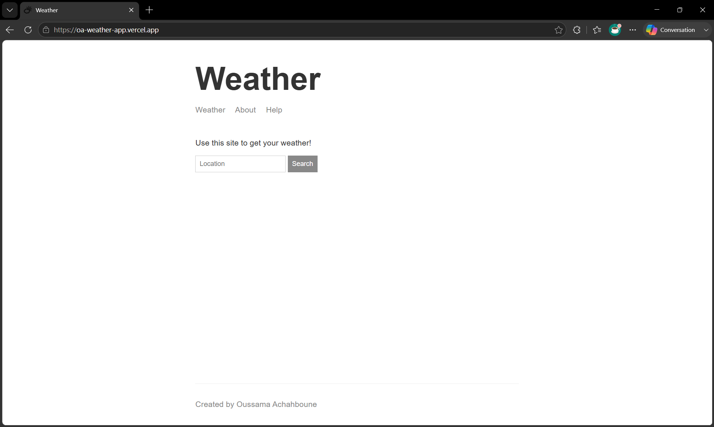
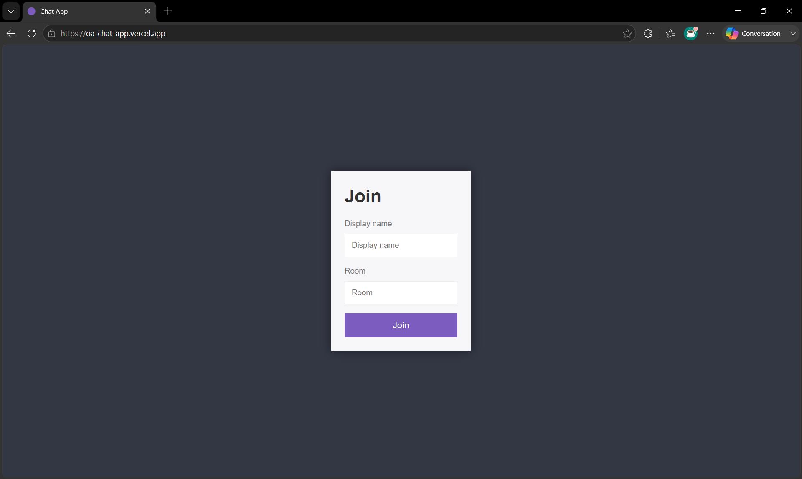
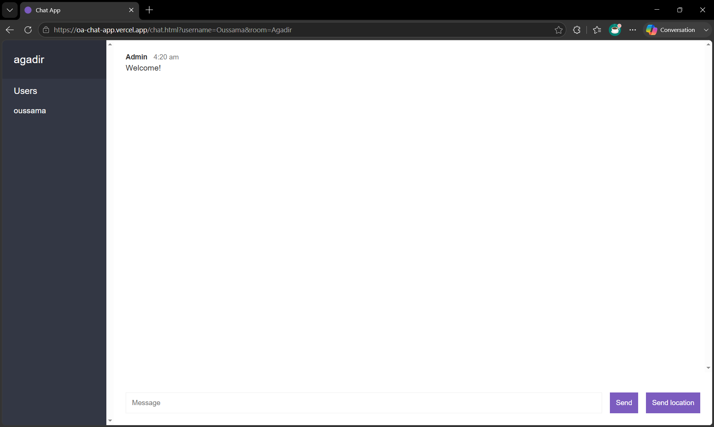

# Node.js Backend Applications

A set of backend applications built with Node.js, covering command-line tools, web applications, REST API development, and event-driven programming.

The projects demonstrate backend development concepts including API design, authentication, database integration, testing, and real-time communication.

## Projects Overview

| Project              | Description                                                              | Key Concepts                                     | Links                                                                                             |
| :------------------- | :----------------------------------------------------------------------- | :----------------------------------------------- | :------------------------------------------------------------------------------------------------ |
| **Notes CLI**        | Command-line notes manager with JSON persistence.                        | File System, CLI, JSON                           | [Source](./notes_app)                                                                             |
| **Weather App**      | Weather forecasting web application powered by external APIs.            | Express, API Integration, HTTP                   | [Live](https://oa-weather-app.vercel.app/) · [Source](./web_server)                               |
| **Task Manager API** | REST API for user and task management with authentication.               | JWT Authentication, MongoDB, Testing             | [API Docs](https://documenter.getpostman.com/view/43208671/2sBXwyFmvL) · [Source](./task_manager) |
| **Real-Time Chat**   | Multi-room chat application with instant messaging and location sharing. | Socket.IO, WebSockets, Event-Driven Architecture | [Live](https://oa-chat-app.vercel.app/) · [Source](./chat_app)                                    |

## Backend Concepts Covered

- REST API design
- Authentication and authorization
- Database modeling with MongoDB
- CRUD operations
- Asynchronous programming
- Third-party API integration
- Real-time communication with WebSockets
- Event-driven architecture
- File uploads and image processing
- Automated API testing
- Deployment with Vercel

## Project Details

### Notes CLI

#### Overview

A command-line application for managing notes with persistent JSON storage. The project focuses on Node.js fundamentals, command-line interfaces, modular application design, and file system operations.

#### Features

- Create, read, list, and remove notes
- Persistent JSON storage
- Command-line interface with `yargs`
- Colored terminal output with `chalk`
- Duplicate title validation

#### Technical Highlights

- Modular project structure
- File system operations with the Node.js `fs` module
- Command-line argument parsing
- JSON serialization and data persistence

---

### Weather App



#### Overview

A weather forecasting web application built with Express that retrieves live weather information from third-party APIs based on a user-provided location.

#### Features

- Search weather by location
- Geocoding with Mapbox
- Live weather forecasts
- Dynamic user interface with Handlebars
- Input and API error handling

#### Technical Highlights

- Express server and routing
- Integration with external REST APIs
- Asynchronous API requests
- Modular utility functions
- Server-side rendering with Handlebars

---

### Task Manager API

#### Overview

A REST API for managing users and personal tasks with secure authentication and persistent data storage. The project follows a modular Express architecture and demonstrates common backend development practices.

#### Features

- User authentication with JWT
- CRUD operations for tasks
- Profile management
- Avatar upload and image processing
- Pagination, filtering, and sorting
- Automated API testing

#### Technical Highlights

- Express middleware
- MongoDB data modeling with Mongoose
- Password hashing using bcrypt
- Resource ownership and authorization
- Image processing with Sharp
- Automated testing with Jest and Supertest

---

### Real-Time Chat

| Join Page | Chat Room |
| :-------: | :-------: |
|  |  |

#### Overview

A real-time chat application that allows users to join rooms, exchange messages, and share their location using WebSocket communication powered by Socket.IO.

#### Features

- Multi-room chat
- Instant messaging
- Location sharing
- Profanity filtering
- Live room participant list

#### Technical Highlights

- Event-driven architecture
- Real-time communication with Socket.IO
- Server-side room management
- Custom event handling
- WebSocket-based messaging

---

## Repository Structure

```text
node-apps-playground/
|-- notes_app/       # Command-line notes manager
|-- weather_app/     # Weather API client
|-- web_server/      # Express weather web application
|-- task_manager/    # Authenticated REST API
|-- chat_app/        # Real-time Socket.IO chat application
`-- playground/      # JavaScript and asynchronous programming experiments
```

Each project is self-contained and includes its own dependencies and configuration.

## Local Setup

### Prerequisites

- Node.js 20+
- npm

Each project is independent and includes its own `package.json`.

Install dependencies from any project directory:

```bash
npm install
```

### Weather App

Create `web_server/src/config/dev.env`:

```env
MAPBOX_API_KEY=your_mapbox_token
WEATHER_API_KEY=your_weatherstack_key
```

### Task Manager API

Create `task_manager/src/config/dev.env`:

```env
PORT=3000
MONGODB_URL=your_mongodb_connection_string
JWT_SECRET=your_jwt_secret
```

## Testing

The Task Manager API includes automated tests covering:

- User authentication
- Protected routes
- Task CRUD operations
- Resource ownership
- Avatar uploads
- Profile updates

Run the test suite from the `task_manager` directory:

```bash
npm test
```

The tests use a dedicated MongoDB database and reset their data between runs to ensure isolated and repeatable execution.
